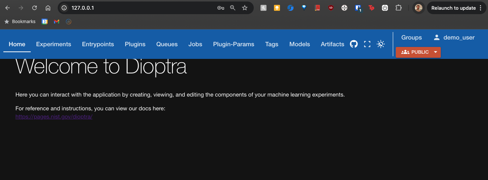
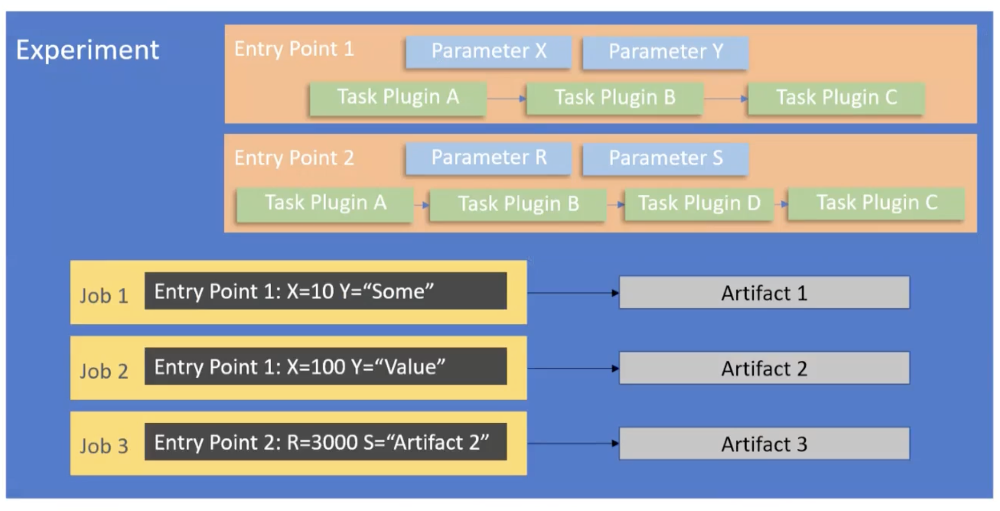
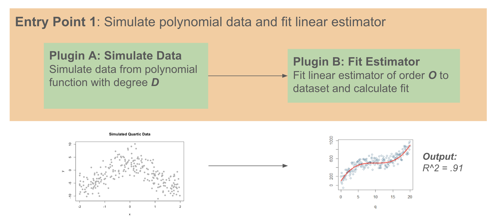
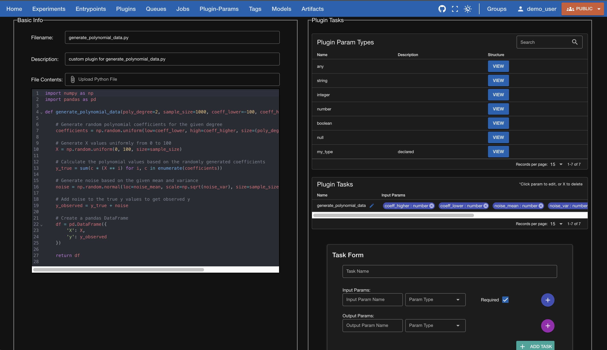
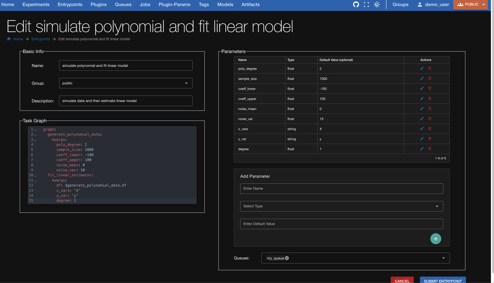
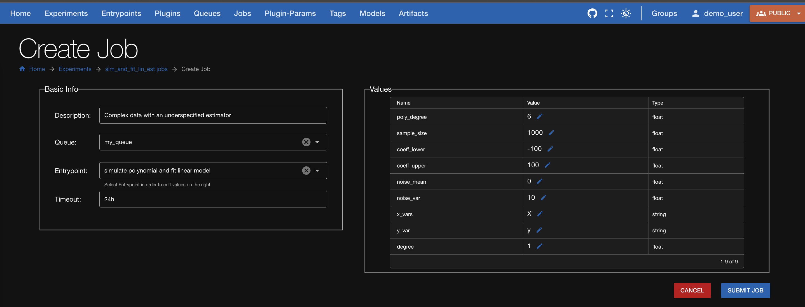

# Dioptra UI Demo
### Running your first experiment using Dioptra's User Interface

## Goal of experiment:
1. Learn the basics of the Dioptra workflow
2. Understand how to build and upload plugins
3. Link plugins together in an entrypoint
4. Parameterize an entrypoint as a job
5. Run multiple jobs as part of an experiment
5. \[todo\] View the artifacts generated from the experiment run

## Dioptra Terminology Quickstart

### **Plugin**
A **Plugin** is essentially a Python function that serves as a fundamental building block of a larger entry point workflow. Plugins can accept parameterized inputs, and their outputs can be used by other plugins.

**Possible Plugins:**
- `initialize_model_parameters.py`
- `load_dataset.py`
- `evaluate_model.py`
- _your_plugin_here.py_

---

### **Entry Point**
An **Entry Point** is a workflow that utilizes one or more Plugins. It consists of four main components:

- **Types**: A declaration of the variable types used within the entry point
- **Parameters**: A collection of parameters (and their default values) that can be passed to plugins
- **Tasks**: A list of plugins that the entry point depends on
- **Graph**: The specified order in which plugins are executed in the entry point, as well as the flow of parameters and plugin outputs to other plugin inputs

The Dioptra UI provides interfaces to specify the types, parameters, and tasks for a given entry point. The **Graph** is defined in a YAML file that the user writes or uploads. 

---

### **Job**
A **Job** is a parameterized instance of an entry point. Instantiating a job allows a user to specify values for the parameters in an entry point or resort to the default parameters. When a job is run, artifacts may be produced and saved. Jobs are also assigned to a queue so that their order of execution can be determiend(?)

---

### **Experiment**
An **Experiment** is a collection of jobs. 

---

### **Artifact**
An **Artifact** is any output from a job. Artifacts could be ML models, evaluation metrics, datasets, or anything else related to the execution of a plugin. 

---

### **Queue**
_A **Queue** is an \[insert description\]_

---

## Demo
**Demo: Simulate Data and Fit Linear Estimator**

To demonstrate the process of building a Dioptra entrypoint and running it within an experiment, we will implement a basic example workflow. In our example workflow, we create an entrypoint that allows users to flexibly simulate data from a polynomial function and then estimate a linear estimator from that simulated data. The parameters of interest are the degree of the underlying polynomial function, which determines the complexity of the relationship between an input and output value, as well as the order of the linear estimator, which determines the quality of fit. The R^2 metric is used as a proxy for the quality of fit of the estimator and is calculated in the second plugin. 

## Demo Workflow
### 1. Create the two plugins

1. In the Dioptra UI, click the `Plugins` banner
2. Click the plus button in the bottom right corner
3. Give your plugin a name, assign it to a group, and add an optional description
4. Your plugin has been created. On the `Plugins` main page, click the carrot underneath the `expand` column on the right hand side for the row corresponding to the plugin you just created
5. On the dropdown that opens up, click `MANAGE [your plug in name]` to add Python files
6. You now see all the files associated with this plugin. Click the `+` at the bottom to create a new associated file 
7. in the `Basic Info` box, add a filename and description and then upload or write Python code. This Python code should be a function that accomplishes your plugin goals. In our case, we will write code to simulate data from a polynomial
8. In the `Plugin Tasks` window on the right hand side, scroll to the bottom `Task Form` section. Name your task (?). For every input and output related to your task, enter them in the input and output forms. Make sure to appropriately select their type and mark if the inputs are required or not. 

| **Creating a Plugin** |
|:--:|
|  |
| *Figure: Screenshot showing the process of creating a Python file named `generate_polynomial_data.py`. Underneath the `Plugin Tasks` section, the input and output parameters are listed.* |
### 2. Create an Entrypoint to link the two plugins

1. In the Dioptra UI, click the `Entrypoints` tab at the top
2. Click the `+` button in the bottom right to add a new entrypoint 
3. Give your entrypoint a name, assign it to a group and add a description. 
4. Within the `Parameters` box on the right hand side, add the two Plugins you just created
5. Within the `Parameters` box on the right hand side, add all the necessary parameters required for these two plugins. These parameters will correspond to the inputs for the plugin functions. 
6. Within the `Task Graph` box on the bottom left hand side, create the Task Graph for the entrypoint. The task graph should be in YAML format. You can find out more about how to structure this Task Graph file [here](https://pages.nist.gov/dioptra/reference/task-engine-reference.html#tasks).
7. Submit your entrypoint

| **Creating an Entrypoint** |
|:--:|
|  |
|:--:|
| *Figure: Screenshot showing the process of creating an entrypoint named `simulate polynomial and fit linear model`.* |

### 3. Create an Experiment and add two Jobs to the experiment
1. In the Dioptra UI, click the `Experiments` tab at the top
2. Click the `+` button in the bottom right to add a new experiment
3. Give your experiment a name, assign a group and write a description
4. Select the entrypoint that was created in step 2
5. Add any desired tags and click `Save Draft`
6. Back in the `Experiments` main page, click on the name of your experiment to open up its associated jobs. (Note: the 'name' of your experiment is the second column and should be formatted as a hyperlink)
7. You are now looking at all the associated jobs for that experiment. To add the first job, click the `+` button on the bottom right hand corner
8. Add a description for the job, assign a queue, choose the entrypoint created in step 2, and choose a timeout amount
9. Parametrize your job. Underneath the `Values` box on the right hand side of the `experiments -> [your_job]-> create Job` page, change the value of any parameters by clicking the pencil icon.
10. Click submit job to save 

| **Creating a Job** |
|:--:|
|  |
|:--:|
| *Figure: Screenshot showing the process of creating a job. In this job, we changed `poly_degree` parameter to 6 and `degree` to 1. The simulated data will be sourced from a complex relationship and the linear estimator will be underspecified, resulting in a relatively low R^2 value.* |

### 4. _[not yet implemented] Generate Artifacts_
1. In the Dioptra UI, click the `Experiments` tab at the top
2. Click the carrot toggle underneath the `expand` column for the row corresponding to your experiment. 
3. Click `Create Arifact` button